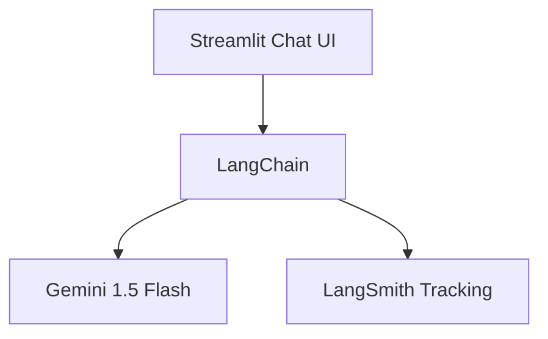

# 🤖 Geminitor

**Geminitor** is a smart, fast, and traceable chatbot powered by **Google Gemini 1.5 Flash** and **LangChain**, with full LLM observability using **LangSmith**.

It offers a sleek ChatGPT-like interface built with **Streamlit**, and it even suggests follow-up questions automatically to guide deeper conversations.

---

## ✨ Features

- 🔥 Powered by **Gemini 1.5 Flash** (via Google Generative AI API)
- 🧠 Built using **LangChain**'s composable LLM pipeline
- 📊 Tracked and monitored with **LangSmith (LLMOps)**
- 💬 Clean, chat-style interface with **Streamlit**
- 🤖 Intelligent follow-up suggestions
- ✅ Lightweight and deployable on Codespaces or Streamlit Cloud


---
## 📸 Screenshots

### 💬 Chat Interface


### 🤖 LLMOPS


## 🚀 How to Run

### 🛠️ Requirements

```bash
pip install -r requirements.txt
````

### ✅ Add API Keys

Create a `.env` file or set these environment variables manually:

```env
# Google Gemini API Key
GOOGLE_API_KEY=your_google_gemini_api_key

# LangSmith (LLMOps) API Key
LANGCHAIN_TRACING_V2=true
LANGCHAIN_API_KEY=your_langsmith_api_key
LANGCHAIN_PROJECT=Geminitor
```

> ⚠️ Never commit your API keys to public repositories.

---

### ▶️ Run the App

```bash
streamlit run main.py
```

If you're using GitHub Codespaces:

```bash
streamlit run main.py --server.port 7860 --server.address 0.0.0.0
```

Then open the forwarded port.

---

## 🧠 Architecture



* **Prompt engineering** via `ChatPromptTemplate`
* **LLM execution** via `ChatGoogleGenerativeAI`
* **Monitoring** via LangSmith's LangChain integration

---

## 🧩 Built With

* [LangChain](https://www.langchain.com/)
* [Google Generative AI SDK](https://ai.google.dev/)
* [LangSmith](https://smith.langchain.com/)
* [Streamlit](https://streamlit.io/)

---

## 📄 File Structure

```bash
.
├── main.py              # Main Streamlit app
├── requirements.txt     # Python dependencies
└── README.md            # You're here
```

---

## 📦 Deployment Options

| Platform            | Status                     |
| ------------------- | -------------------------- |
| ✅ GitHub Codespaces | Ready                      |
| ✅ Streamlit Cloud   | Deploy easily              |
| 🔜 Docker           | Optional container support |

---

## 🛡️ Disclaimer

This is a demo app for educational and prototyping purposes. Do not expose sensitive data or rely on it for production use without securing your API keys and backend.

---

## 💡 Author

Built by Tanmay 🚀
With love for LLMs, clean UIs, and observability.

---

## 🏷️ Tags

`#Gemini` `#LangChain` `#LLMOps` `#LangSmith` `#Streamlit` `#Chatbot` `#OpenAIAlt` `#AI`

````

---

## 📎 Bonus: Add `requirements.txt`

Here's a sample `requirements.txt` file:

```txt
streamlit
langchain
langchain-google-genai
google-generativeai
````

---
